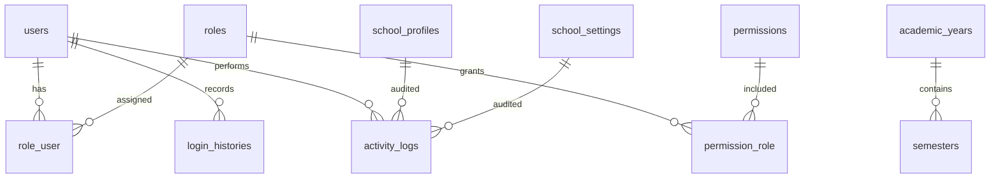

# Database Design

Tabel fondasi: users, roles, permissions, permission_role, role_user, school_profiles, academic_years, semesters, school_settings, login_histories, activity_logs, cache, sessions, jobs.
