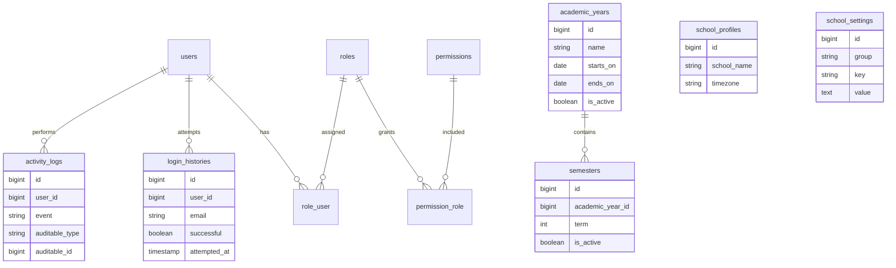

# Database Design

Database memakai MySQL/MariaDB dengan `utf8mb4` dan collation Unicode. Uang menggunakan `decimal`, relasi penting memakai foreign key, nomor unik memakai unique constraint, dan data historis finansial dibatalkan dengan void/reversal.

## Tabel Terencana per Modul

Core: `users`, `roles`, `permissions`, `school_profiles`, `school_settings`, `academic_years`, `semesters`, `login_histories`, `activity_logs`, `files`.

Akademik: `employees`, `teachers`, `students`, `guardians`, `student_guardians`, `grade_levels`, `classrooms`, `class_students`, `subjects`, `teaching_assignments`, `class_schedules`.

Absensi dan jurnal: `teacher_work_schedules`, `teacher_attendances`, `teacher_attendance_corrections`, `teacher_leave_requests`, `student_attendances`, `teaching_journals`, `teaching_journal_attendances`.

BTAQ dan nilai: `btaq_groups`, `btaq_group_students`, `qiroati_levels`, `btaq_targets`, `btaq_journals`, `memorization_deposits`, `assessment_types`, `assessments`, `student_grades`, `report_cards`.

Tagihan dan keuangan: `fee_types`, `fee_structures`, `student_bills`, `student_bill_items`, `payment_transactions`, `payment_allocations`, `financial_accounts`, `financial_categories`, `financial_transactions`, `payroll_periods`, `payrolls`, `payroll_details`.

Administrasi: `inventory_categories`, `inventory_items`, `inventory_movements`, `work_programs`, `work_program_progresses`, `incoming_letters`, `outgoing_letters`, `announcements`, `calendar_events`.
