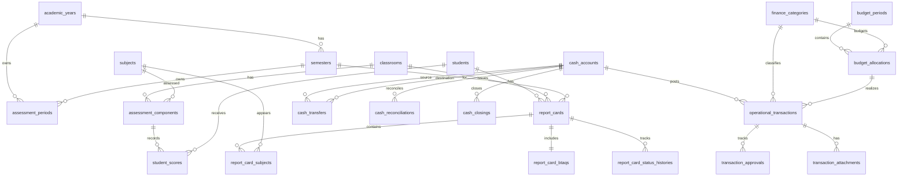

# ERD Modul Penilaian dan Keuangan

```mermaid
erDiagram
  academic_years ||--o{ semesters : has
  academic_years ||--o{ assessment_periods : owns
  semesters ||--o{ assessment_periods : owns
  classrooms ||--o{ assessment_components : has
  subjects ||--o{ assessment_components : assessed
  assessment_components ||--o{ student_scores : records
  students ||--o{ student_scores : receives
  students ||--o{ report_cards : has
  classrooms ||--o{ report_cards : issues
  semesters ||--o{ report_cards : for
  report_cards ||--o{ report_card_subjects : contains
  subjects ||--o{ report_card_subjects : appears
  report_cards ||--o{ report_card_status_histories : tracks
  report_cards ||--|| report_card_btaqs : includes

  cash_accounts ||--o{ operational_transactions : posts
  finance_categories ||--o{ operational_transactions : classifies
  budget_periods ||--o{ budget_allocations : contains
  finance_categories ||--o{ budget_allocations : budgets
  budget_allocations ||--o{ operational_transactions : realizes
  cash_accounts ||--o{ cash_transfers : source
  cash_accounts ||--o{ cash_transfers : destination
  operational_transactions ||--o{ transaction_attachments : has
  operational_transactions ||--o{ transaction_approvals : tracks
  cash_accounts ||--o{ cash_reconciliations : reconciles
  cash_accounts ||--o{ cash_closings : closes
```
