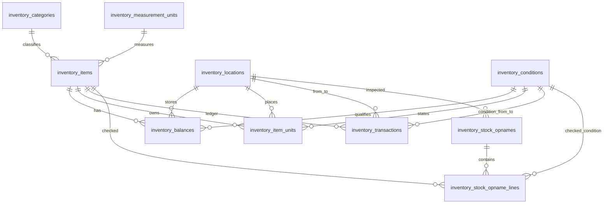

# ERD Inventaris dan Aset

```mermaid
erDiagram
  inventory_categories ||--o{ inventory_items : classifies
  inventory_measurement_units ||--o{ inventory_items : measures
  inventory_locations ||--o{ inventory_balances : stores
  inventory_conditions ||--o{ inventory_balances : qualifies
  inventory_items ||--o{ inventory_balances : has
  inventory_items ||--o{ inventory_item_units : owns
  inventory_locations ||--o{ inventory_item_units : places
  inventory_conditions ||--o{ inventory_item_units : states
  inventory_items ||--o{ inventory_transactions : ledger
  inventory_locations ||--o{ inventory_transactions : from_to
  inventory_conditions ||--o{ inventory_transactions : condition_from_to
  inventory_locations ||--o{ inventory_stock_opnames : inspected
  inventory_stock_opnames ||--o{ inventory_stock_opname_lines : contains
  inventory_items ||--o{ inventory_stock_opname_lines : checked
  inventory_conditions ||--o{ inventory_stock_opname_lines : checked_condition
```
